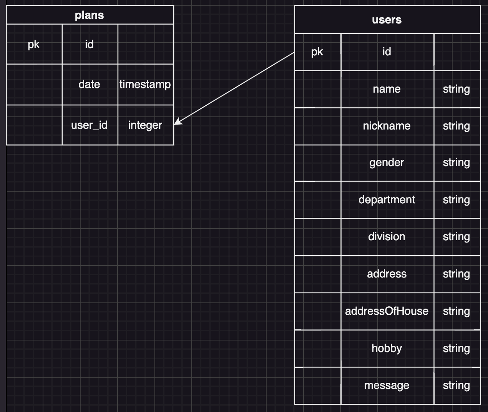

# Backend

## 本番環境の URL

バックエンドのみ Heroku にデプロイしています。  
BaseURL: https://megry-app-88b135b9cdab.herokuapp.com  
※2024 年 7 月 26 日にて公開終了

## 使用方法

1.自身の PC にデータベースを作成する  
`createdb megrydb`  
2. backend リポジトリを PC に clone する  
`git clone {URL or SSH}`  
2.clone したディレクトリに移動して env ファイルを作成する  
`touch .env`  
3.env ファイルに環境変数を設定する　　　
`DB_NAME={db name}`  
`DB_USER={user name}`  
`DB_PASSWORD={password }`  
4.パッケージをインストール  
`npm install`  
5.サーバーを起動する  
`npm run dev`  
6.(任意)テストデータを挿入したい場合は seed を実行
`npm run seed`

## エンドポイントの説明

<image src="./Images/エンドポイント.png" />

## スキーマ設計

### テーブル説明

<dl>
    <dt>users</dt>
    <dd>id:一意のid</dd>
    <dd>name:名前</dd>
    <dd>nickname:ニックネーム</dd>
    <dd>gender:性別（男性or女性）</dd>
    <dd>department:所属部署名(⚪︎⚪︎部)</dd>
    <dd>division:所属部署名(⚪︎⚪︎課)</dd>
    <dd>division:所属部署名(⚪︎⚪︎課)</dd>
    <dd>address:相乗り方面</dd>
    <dd>addressOfHouse:おうちの住所</dd>
    <dd>hobby:趣味</dd>
    <dd>message:相乗りメンバーへ一言</dd>
    <dt>plans</dt>
    <dd>id:一意のid</dd>
    <dd>date:日付(2024-05-01 22:00:00)</dd>
    <dd>user_id:どのユーザーか判別</dd>
    
</dl>
