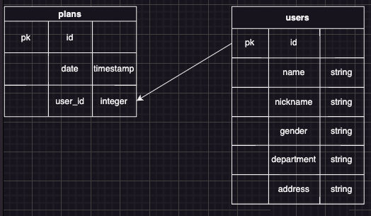

# Backend

## Ver01

サーバー起動ができる最小限実装

## 使用方法

1.自身の PC にデータベースを作成する  
`createdb megrydb`  
2.env ファイルを作成する  
`touch .env`  
3.env ファイルに環境変数を設定する　　　
`DB_NAME={db name}`  
`DB_USER={user name}`  
`DB_PASSWORD={password }`  
4.パッケージをインストール  
`npm install`  
5.サーバーを起動する  
`npm run dev`  
6.(任意)テストデータを挿入したい場合は seed を実行
`npm run seed`

## エンドポイントの説明

| エンドポイント | メソッド |                    response                    |
| :------------: | :------: | :--------------------------------------------: |
|     /users     |   GET    | [{id,name,nickname,gender,department,address}] |
|     /plans     |   GET    |              [{id,date,user_id}]               |

## スキーマ設計

### テーブル説明

<dl>
    <dt>users</dt>
    <dd>id:一意のid</dd>
    <dd>name:名前</dd>
    <dd>nickname:ニックネーム</dd>
    <dd>gender:性別（男性or女性）</dd>
    <dd>department:所属部署名(⚪︎⚪︎部⚪︎⚪︎課)</dd>
    <dt>plans</dt>
    <dd>id:一意のid</dd>
    <dd>date:日付(2024-05-01 22:00:00)</dd>
    <dd>user_id:どのユーザーか判別</dd>
    
</dl>
